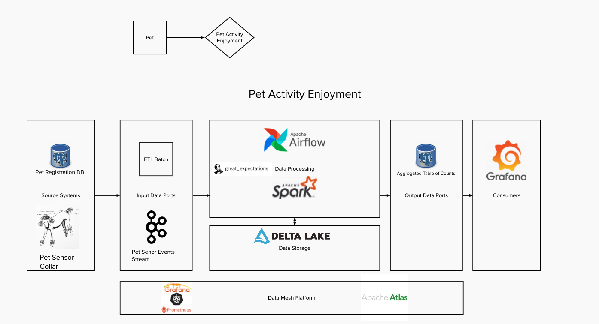

# pet-project : pet activity enjoyment data product
The year is 2050 and we finally have the technology to read the minds of our pets in a non-invasive fashion. This is where Acme Pet comes in. Acme has developed a collar for your pet that once registered you can send your pets thoughts to their servers and understand what activities your pet most enjoys. Conveniently Acme has an online Pet store that uses this data to help recommend items you can purchase to increase your pets happiness. In order to do this they need to create a data product that combines event data directly from your pets brain and join it with their pet registration database. One this is done they will take this data and create another Data Product that will perform Pet Segmentation for future recommendations. 

# Requirements and Run
You will need to install Docker and Docker-Compose in order to run this project.
In addition, Docker will require at least 6 CPU, 10 GB of Memory and 2 GB of Swap.

docker-compose up

# DataHub
If you would like to check out the Datahub integration there is a branch datahub_addition that you can leverage in place of the Amundsen/Atlas combination on the main for Data Lineage and Data Catalog.
