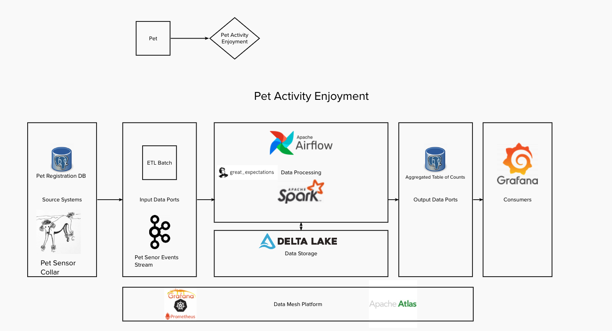

# pet-project : pet activity enjoyment data product

The year is 2050 and we finally have the technology to read the minds of our pets in a non-invasive fashion. This is where Acme Pet comes in. Acme has developed a collar for your pet that once registered you can send your pets thoughts to their servers and understand what activities your pet most enjoys. Conveniently Acme has an online Pet store that uses this data to help recommend items you can purchase to increase your pets happiness. In order to do this they need to create a data product that combines event data directly from your pets brain and join it with their pet registration database. Once this is done they will take this data and create another Data Product that will perform Pet Segmentation for future recommendations.



## Architecture

This project uses a modern data stack:

| Component | Technology | Purpose |
|-----------|------------|---------|
| Workflow Orchestration | **Prefect 3** | DAG management and scheduling |
| Data Catalog & Lineage | **OpenMetadata** | Metadata management, data discovery |
| Stream Processing | **Apache Kafka** | Event streaming from pet sensors |
| Batch Processing | **Apache Spark** | Large-scale data transformations |
| Monitoring | **Prometheus + Grafana** | System and pipeline monitoring |

## Requirements

- Docker and Docker Compose v2.1+
- Minimum resources: **6 CPU, 12 GB Memory, 2 GB Swap**
- Python 3.11+ (for local development)
- [uv](https://docs.astral.sh/uv/) (recommended for Python package management)

## Quick Start

### 1. Start the infrastructure

```bash
docker compose up -d
```

### 2. Access the UIs

| Service | URL | Credentials |
|---------|-----|-------------|
| Prefect Server | http://localhost:4200 | No auth required |
| OpenMetadata | http://localhost:8585 | admin@open-metadata.org / admin |
| Kafka Control Center | http://localhost:9021 | No auth required |
| Spark Master | http://localhost:8082 | No auth required |
| Grafana | http://localhost:3000 | No auth (anonymous admin) |
| Prometheus | http://localhost:9090 | No auth required |

### 3. Deploy a flow

```bash
# Install dependencies locally
uv sync

# Deploy the flow to Prefect
uv run prefect deploy flows/pet_activity_enjoyment.py:pet_activity_enjoyment_flow \
    --name pet-activity-enjoyment \
    --pool local-pool
```

### 4. Run the flow

```bash
# Trigger a flow run from the CLI
uv run prefect deployment run pet-activity-enjoyment-data-product/pet-activity-enjoyment
```

Or trigger from the Prefect UI at http://localhost:4200

## Local Development

### Setup with uv

```bash
# Install uv (if not already installed)
curl -LsSf https://astral.sh/uv/install.sh | sh

# Create virtual environment and install dependencies
uv sync

# Install dev dependencies
uv sync --dev

# Run tests
uv run pytest

# Run linting
uv run ruff check .
uv run ruff format .
```

### Project Structure

```
pet-project/
├── flows/                      # Prefect flows
│   ├── __init__.py
│   └── pet_activity_enjoyment.py
├── tests/                      # Test files
│   └── test_flows.py
├── data/                       # Data files and configs
│   ├── pet_sensor/            # Pet sensor data
│   └── prometheus/            # Prometheus configuration
├── docker-compose.yml          # Infrastructure definition
├── Dockerfile.worker           # Prefect worker image
├── pyproject.toml             # Python project configuration
└── README.md
```

## Services

### Prefect (Workflow Orchestration)

- **Server**: http://localhost:4200 - Web UI for managing flows
- **Worker**: Executes flows in the `local-pool`
- **PostgreSQL**: Stores Prefect metadata
- **Redis**: Message broker for distributed execution

### OpenMetadata (Data Catalog)

- **Server**: http://localhost:8585 - Data catalog UI
- **MySQL**: Stores metadata
- **Elasticsearch**: Powers search functionality

### Kafka (Event Streaming)

- **Broker**: localhost:9092 - Kafka broker
- **Schema Registry**: http://localhost:8081 - Avro schema management
- **Control Center**: http://localhost:9021 - Kafka management UI

### Spark (Data Processing)

- **Master**: http://localhost:8082 (UI), spark://localhost:7077 (submit)
- **Worker**: Connected to master with 2GB memory, 2 cores

### Monitoring

- **Prometheus**: http://localhost:9090 - Metrics collection
- **Grafana**: http://localhost:3000 - Dashboards and visualization
- **cAdvisor**: http://localhost:8083 - Container metrics
- **Node Exporter**: localhost:9100 - Host metrics

## License

Apache License 2.0
